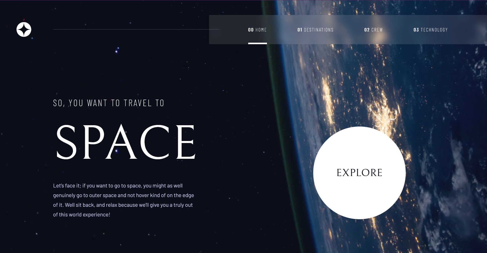

# Space Tourism Webpage

## Table of contents

- [Overview](#welcome)
  - [Overview of some the things I learnt along the way](#overview-of-some-of-the-things-i-learnt-along-the-way)
  - [Links](#links)
  - [Achievements](#achievements)
  - [Quirks](#quirks)
- My process
  - [Some points to discuss](#some-points-to-discuss)
  - [Built with](#built-with)
  - [Further development](#further-development)
- [Author](#author)
- [Acknowledgments](#acknowledgments)

## Welcome

This site uses purely `.html` and `.css` to achieve all its design challenges. But because of that, the site has certain quirks that I want to disucss.  
But first lets go through what I was able to achieve through this challenge.

## Overview of some of the things I learnt along the way

+ Some solid Google-fu to find out the ways internet solve their problems similar to mine. Many consider this to be a key skill and while searching a solution might not be difficult, it's the implementation of their said solution into our project that matters.
+ Pre-planning the layout of HTML to make life easier while writing the CSS stylesheet.
+ The uses, precedence and priority of HTML tags, class and id and other combination of selector to select specific element without too much clutter and confusion.
+ The importance of `meta` tag to specfically tell screens to scale according to phone screens.
+ Use of `div` to wrap around elements and control them effectively.
+ Using flexbox as an powerful way to arrange (and rearrange) the different elements of HTML and also most convenient way to center elements.
+ Checkboxes of CSS as condtional to implement very basic level of dynamic behavior.
+ **A nice filter/frost effect that works on all browsers because Firefox at the moment doesn't support `backdrop-filter`.** This one took a lot of headbanging 😂. CSS Pseudo-class are a way to implement interesting design techniques.
+ The sidebar implementation on the mobile version of the page is probably a big learning point for me. And it also showed me why a javascript appraoch might make it a lot more simpler / easier to understand.

## Links

- Solution URL: [Solution URL here](https://github.com/arkni8/space-tourism-webpage)
- Live Site URL: [Live site URL here](https://arkni8.github.io/space-tourism-webpage/)

## Achievements

Users are able to:

+ View the optimal layout for each of the website's pages depending on their device's screen size
+ See hover states for all interactive elements on the page
+ View each page and be able to toggle between the tabs to see new information

## Quirks

- No caraousel implementation that most users will probably expect [on this page](https://arkni8.github.io/space-tourism-webpage/html/crew-pilot.html)
- The frost effect of navigation/sidebar looks mostly great but if you look too closely, you will find unblurred image at the edges of the screen. This is a limitation of the `filter: blur()` and I have yet to find a workaround for it.
- It doesn't support hot reload, so every link reloads the page, but since the pages itself are small, I didn't think it matters too much.
- Debbugging the CSS might be tough since the codes are lengthy and while I have tried my best to refactor the code, its still lengthy. I have divided the CSS into two parts, one part dealing with just the navigation header, and the other part dealing with just styling the rest of the body.
- The media queries make the responsive logic especially lengthy. Is there a way to make a more responsive page without writing that media queries like I have? I don't have an answer to that yet.

### Some points to discuss

+ Initially I added Bootstrap to help with building responsive layouts faster. But I found out very soon that when you have a lot of custom elements and design, controlling Bootstrap becomes a lot more challenging as you try to contest the CSS of Bootstrap elements. That is when I also learned that stylesheet precedence also matters when you insert it at the header of a HTML. **So always insert Bootstrap stylesheet over all the custom stylesheet, and not doing so is going to cause a lot of headache.** The scripts are also prewritten and modifying them is a lot more painful, so in the end, its just better to design the page ground up. It was definitely a lot faster than fumbling with default behavior of Bootstrap.
+ Using CSS Pseudo-class was a genius move made by gentlemen on StackOverflow. Some were able to use Pseudo-class trick CSS into adding effect that I was not able to otherwise. I improvised his idea and implemented it in another form on this website. [Here is a demo.](https://codepen.io/betravis/pen/xxGPJm)
+ After removing Bootstrap, I had to rely on pure CSS to implement Sidebar and I just followed [this very simple idea](https://codepen.io/plavookac/pen/qomrMw) to make the sidebar work. After that, it was just a couple of media queries away from having a  fully responsive site.
+ Font scaling is a huge issue when trying to make a responsive website. Its especially tough when we think about all the 4k screens that have become a common place in today's world. While 1080p resolution is still largely popular, we cant deny the existence of 2k and 4k screens now and they are more than ever in the wild. That said, I wanted to make sure this website looks equally great on those VERY large screens. So I set about trying to find ways of doing it. Besides writing media queires, the helpful tips were usually using CSS preprocessors to make CSS coding easier, but I didn't find time to fully sink my teeth into any of them. I ended up writing a lot of media queries just to scale the fonts properly.
  
  But just planning out the media queries is not enough (which by themselves can be a handful) - there are couple of ways to scale fonts depending on what we are trying to achieve. In my case, I just made it such that my fonts scale continuously regardless of any breakpoint. I use the viewport width to make the fonts bigger or smaller. So when in 4K, the font size is proportionally big; but in 1080p, the fonts are smaller, but they look right because the HTML elements are also smaller. While I have employed this method, other web desginers seem to adopt the breakpoint technique, where they switch font size only after hitting a certain breakpoint.
  
  The HTML divs and container are usually the ones which scale continuously with the width of the viewport. But they prefer to have their sites overflow in y-direction and have a scroll bar appear to take up the reduced space until a breakpoint hits and the font size reduces.  
  There is also the case of resolution scaling because probably 100% of 4K screens have some kind of display scaling enabled which zooms in the viewport, thus bringing down the effective resolution to somewhere around 2K screens. 
  
  It took me a while to wrap my head around this, but I think I understand a little. Although I would like to talk to some page designers to understand their approach too. I think that will help me greatly.
 
### Built with

+ HTML
+ CSS

### Further development

+ Add caraousel
+ Migrate to React framework for a more modern approach, see how much better it could get (or maybe it gets complex?)

### Author

Tanmaya Biswal

### Acknowledgments

I would primarily thank Frontend Mentor to giving me a challenge which could push my vision and inspire me to look for ways to implement new techniques and features that I couldn't have thought about as I started Web development only a month or two ago. This project works like a great stepping stone for me and gives me confidence about what I am able to achieve by myself.
